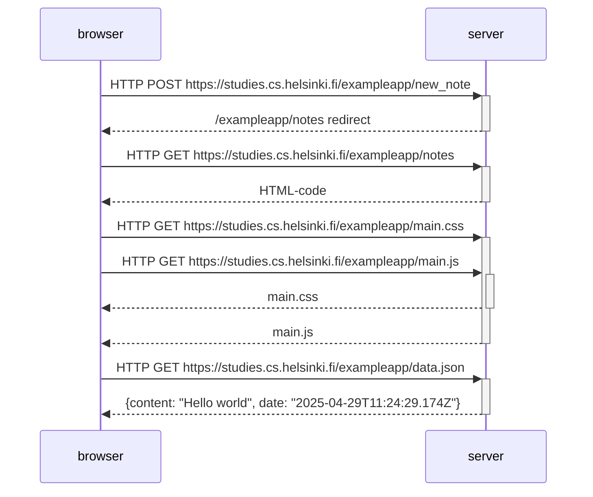

```mermaid
sequenceDiagram
    browser->>+server: HTTP POST https://studies.cs.helsinki.fi/exampleapp/new_note
    server-->>-browser: /exampleapp/notes redirect
    browser->>+server: HTTP GET https://studies.cs.helsinki.fi/exampleapp/notes
    server-->>-browser: HTML-code
    browser->>+server: HTTP GET https://studies.cs.helsinki.fi/exampleapp/main.css
    browser->>+server: HTTP GET https://studies.cs.helsinki.fi/exampleapp/main.js
    server-->>-browser: main.css
    server-->>-browser: main.js
    browser->>+server: HTTP GET https://studies.cs.helsinki.fi/exampleapp/data.json
    server-->>-browser: {content: "Hello world", date: "2025-04-29T11:24:29.174Z"}
```
